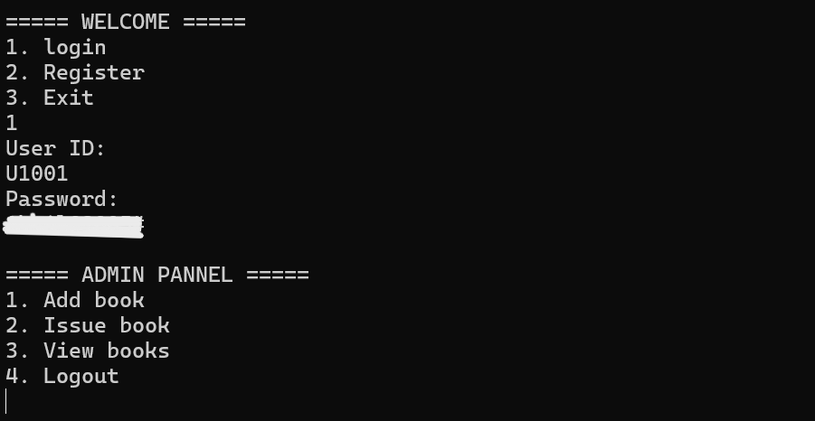
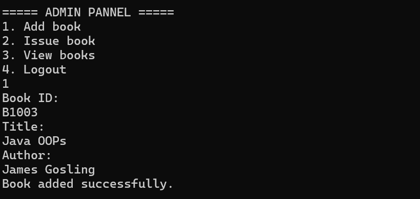
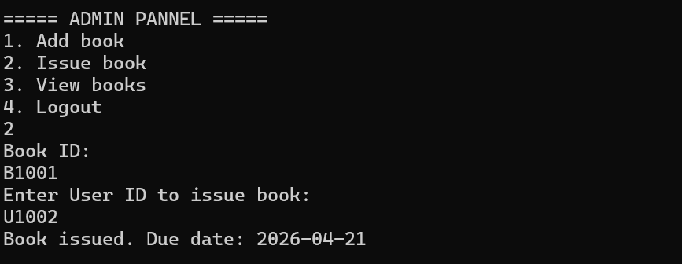
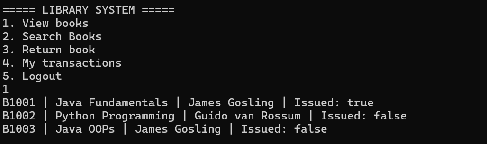
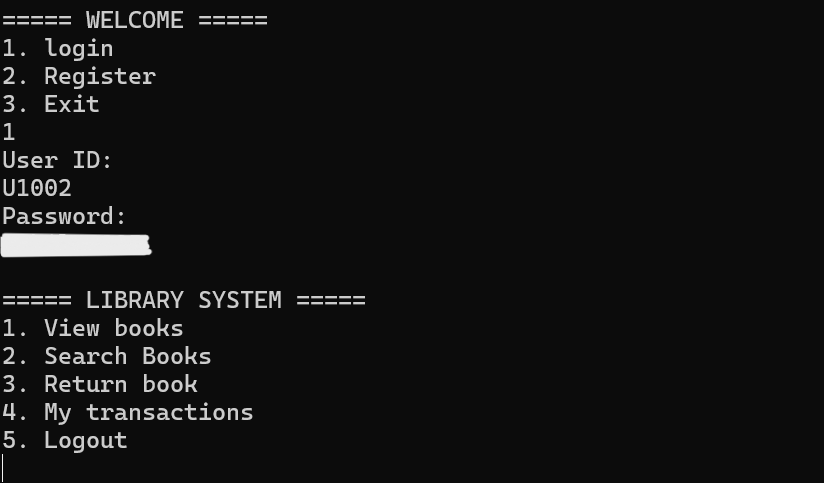
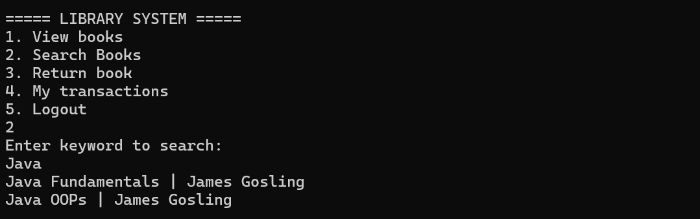
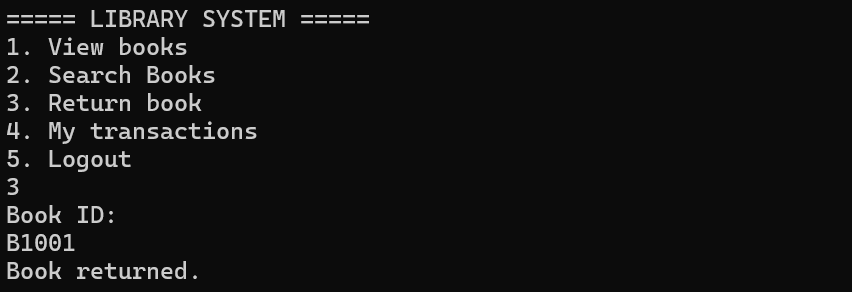
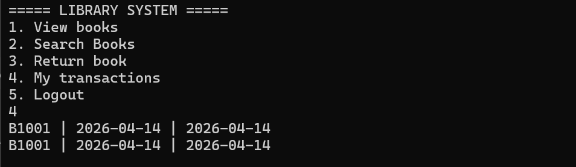
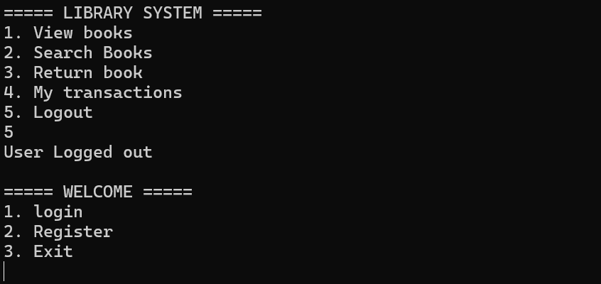

# 📚 Library Management System (Java + JDBC + MySQL)

A console-based Library Management System built using Java, JDBC, and MySQL.  
This project automates book management, user handling, and transaction tracking with role-based access control.

---

## 🚀 Features

### 👨‍💼 Admin
- Add new books
- Issue books to users
- View all books

### 👤 User
- View available books
- Search books by title
- Return books
- View personal transaction history

### 🔐 Authentication
- User Login & Registration
- Role-based access (Admin/User)

### 💡 Advanced Features
- Due date tracking
- Fine calculation for late returns
- MySQL database integration
- Input validation & error handling

---

## 🛠️ Tech Stack

- Java (Core Java, OOP)
- JDBC
- MySQL

## 🔹 How to Run
1. Set environment variables:
   - DB_URL
   - DB_USER
   - DB_PASSWORD
2. Compile:
   javac -cp ".;mysql-connector-j-9.6.0.jar" *.java
3. Run:
   java -cp ".;mysql-connector-j-9.6.0.jar" Main

---

## 🗄️ Database Schema

### Users Table
- user_id
- name
- password
- role

### Books Table
- book_id
- title
- author
- is_issued

### Transactions Table
- book_id
- user_id
- issue_date
- due_date
- return_date

---

## 📸 Screenshots

### 🔹 Welcome Screen

### 🔹 Admin Panel

### 🔹 Add Book

### 🔹 Issue Book

### 🔹 View Books

### 🔹 User Menu

### 🔹 Search Book

### 🔹 Return Book

### 🔹 Transactions

### 🔹 Logout

---

## 🧠 Concepts Used

- Object-Oriented Programming (OOP)
- Encapsulation & Abstraction
- JDBC Connectivity
- SQL Queries
- Role-Based Access Control

---

## 💼 Use Case

This system helps libraries automate:
- Book tracking
- User management
- Borrow/return operations
- Fine calculation

---

## 📌 Future Enhancements

- GUI (Java Swing / JavaFX)
- Web version (Spring Boot)
- Password encryption
- Admin dashboard

---

## 👨‍💻 Author

Akhilanandateja Sanga

---

## ⭐ If you like this project

Give it a ⭐ on GitHub!